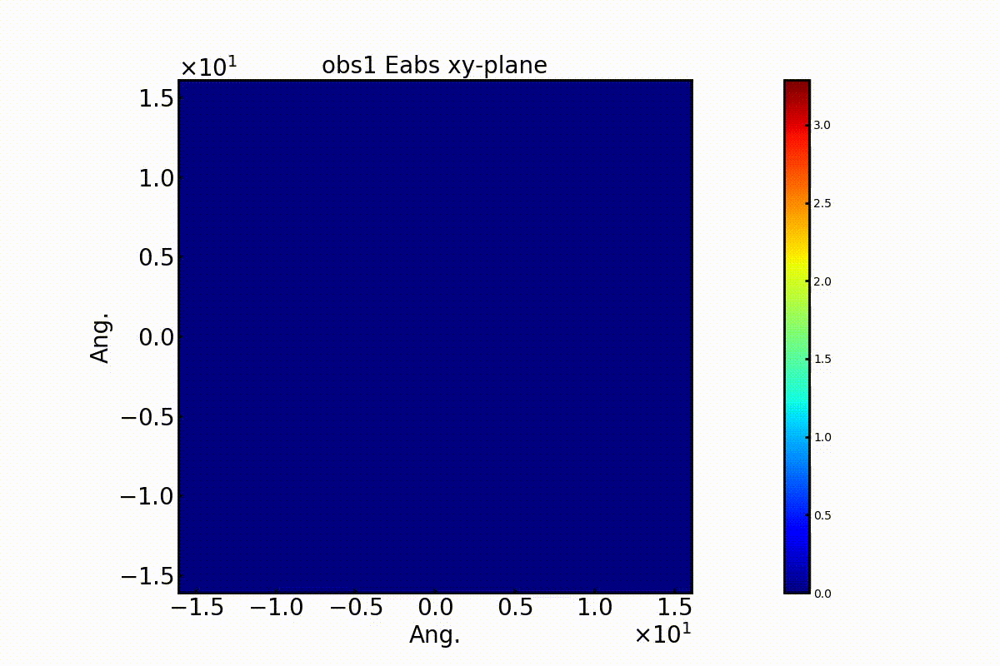

# FDTD_make_figani

[SALMON](https://salmon-tddft.jp/) has a FDTD functionality to simulate electromagnetic problems. This program makes figures and animations from the results obtained by SALMON.

## Requirements

 - Python 3
 - NumPy
 - matplotlib
 - ffmpeg

If you are windows user who uses python for the first time, I recommend to install [WinPython](https://sourceforge.net/projects/winpython/) that includes all requirements for this program.

## Usage

`make_figani.py` is an executable file. `figani.inp` is a input file. `make_figani.py` and `figani.inp` **must be in the same hierarchy**.  
The input parameters are as follows: 

- ***dir_name***  
Name of directory that includes the results obtained by SALMON. Default is `'./'`.

- ***make_ani***  
Enable(`'y'`)/disable(`'n'`) making an animation file. If `'all'`, all animation files depending on `obs_ani`, `var_ani`, `com_ani`, and `pla_ani` are made. 

- ***obs_ani***  
Observation point number that is used for making the animation.

- ***var_ani***  
Name of varialbe that is used for making the animation. `'e'` and `'h'` can be chosen.

- ***com_ani***  
Name of component that is used for making the animation. `'x'`, `'y'`, `'z'`, and `'abs'` can be chosen.

- ***pla_ani***  
Name of plane that is used for making the animation. `'xy'`, `'yz'`, and `'xz'` can be chosen.

- ***frame_speed_ani***  
Time for 1 frame in the animation.

- ***e_max_fig/e_min_fig***  
Maximum/Minimum of the electric filed in the figure file.

- ***h_max_fig/h_min_fig***  
Maximum/Minimum of the magnetic filed in the figure file.

- ***e_max_ani/e_min_ani***  
Maximum/Minimum of the electric filed in the animation file.

- ***h_max_ani/h_min_ani***  
Maximum/Minimum of the magnetic filed in the figure file.

- ***x_max_ani/x_min_ani***  
Maximum/Minimum of the x axis in the figure file.

- ***y_max_ani/y_min_ani***  
Maximum/Minimum of the y axis in the figure file.

- ***z_max_ani/z_min_ani***  
Maximum/Minimum of the z axis in the figure file.

## External Links

### SALMON Project
  - SALMON Official Website - https://salmon-tddft.jp/
  - SALMON Github Repository - https://github.com/salmon-tddft/SALMON/
